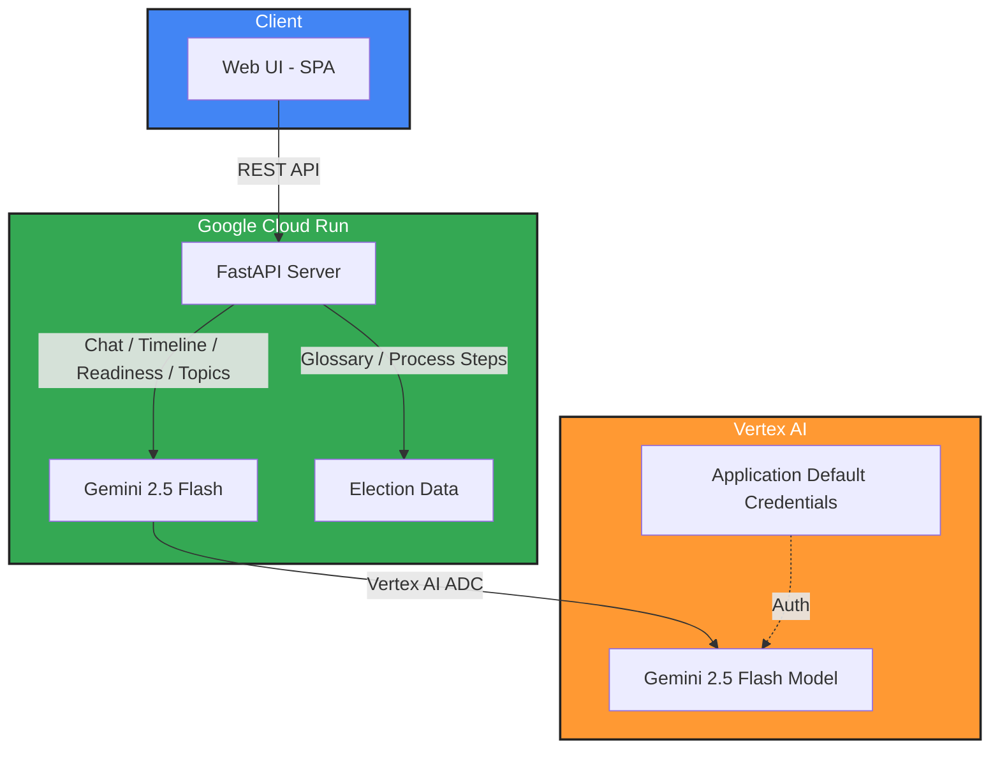

# CivicLens AI — Election Process Education Assistant

An interactive AI-powered platform that helps users understand election
processes, timelines, voter registration, and civic participation through
conversational AI — powered by Gemini 2.5 Flash and Vertex AI.

## Architecture



## Tech Stack

| Component  | Technology                   | Purpose                              |
| ---------- | ---------------------------- | ------------------------------------ |
| AI Model   | Gemini 2.5 Flash (Vertex AI) | Reasoning, generation, education     |
| Backend    | FastAPI (Python 3.11)        | REST API with Pydantic validation    |
| Frontend   | Vanilla HTML/CSS/JS          | Neo-Brutalist accessible SPA         |
| Auth       | Vertex AI ADC                | Application Default Credentials      |
| Deployment | Google Cloud Run             | Serverless container hosting         |
| Testing    | pytest + httpx               | Async API and unit tests             |

## Features

- **AI Chat**: Conversational assistant for election process questions
- **Election Process Guide**: Step-by-step visual walkthrough of how voting works
- **Timeline Generator**: AI-generated election timelines for any country
- **Voter Readiness Check**: Self-assessment quiz with AI-powered feedback
- **Election Glossary**: Searchable database of 25+ electoral terms
- **Non-Partisan**: Factual, neutral education without political bias
- **Accessible**: WCAG-compliant with keyboard navigation, ARIA labels, skip links

## Prerequisites

- Python 3.11+
- Google Cloud project with Vertex AI API enabled
- `gcloud` CLI installed and authenticated

## Local Development

```bash
cd civic_lens
pip install -r requirements.txt

export GOOGLE_CLOUD_PROJECT=your-project-id
export GOOGLE_GENAI_USE_VERTEXAI=TRUE
export GOOGLE_CLOUD_LOCATION=us-central1

uvicorn main:app --reload --port 8080
```

## Run Tests

```bash
pytest -v
```

## Deploy to Cloud Run

```bash
gcloud run deploy civic-lens-ai \
  --source . \
  --region us-central1 \
  --allow-unauthenticated \
  --set-env-vars="GOOGLE_GENAI_USE_VERTEXAI=TRUE,GOOGLE_CLOUD_PROJECT=your-project-id,GOOGLE_CLOUD_LOCATION=us-central1" \
  --memory 512Mi \
  --timeout 60
```

## API Endpoints

| Method | Path            | Description                          |
| ------ | --------------- | ------------------------------------ |
| GET    | /api/health     | Service health check                 |
| POST   | /api/chat       | AI chat about elections              |
| POST   | /api/timeline   | Generate election timeline           |
| POST   | /api/readiness  | Voter readiness self-assessment      |
| POST   | /api/topic      | AI explanation of electoral topic    |
| GET    | /api/glossary   | Full election glossary               |
| GET    | /api/process    | Step-by-step election process guide  |

## Security

- Input validation via Pydantic models with field constraints
- CORS middleware with configurable allowed origins
- No hardcoded credentials — uses Application Default Credentials
- Request size limits on all user inputs

## License

MIT
